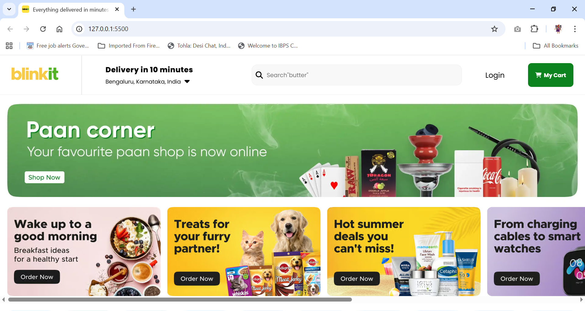

# 🌐 Blinkit Clone (Practice Project)
[](https://developer.mozilla.org/en-US/docs/Web/HTML) 
[](https://developer.mozilla.org/en-US/docs/Web/CSS) 
[]()

🌐 **Live Demo:** [Blinkit Clone](https://sandhyachinthamani.github.io/Blinkit-clone-project/)

---

🚀 **Overview**  
This is one of my **first few projects** after starting to learn HTML, CSS, and web layout techniques.  
It’s a **practice webpage clone** of the Blinkit homepage (Grofers) — built to explore **flexbox, image layouts, and overflow handling** in CSS.

---

## 🧠 What I Learned

- 🧩 Using **Flexbox** for horizontal layouts  
- 🎨 Managing **image grids and responsive sections**  
- ⚙️ Fixing **horizontal overflow (x-scroll)** using `overflow-x: hidden` and layout corrections  
- 💡 Structuring a webpage with **header, sections, and footer**

---

## 💻 Tech Stack

| Tech | Purpose |
|------|----------|
| 🧱 HTML5 | Structure of the webpage |
| 🎨 CSS3 | Styling and layout |
| 🧭 Flexbox | Responsive alignment and scrolling sections |

---

## 🧾 Features

✨ Clean layout inspired by **Blinkit (Grofers)**  
🖼️ Image sections with scrollable overflow  
💅 Practice of CSS `flex`, `gap`, and responsive design basics  
🚫 Fixed unwanted **horizontal scroll** issue  

---

## 🖼️ Screenshot



---

## 🔗 Live Demo

🌍 **Demo Link:** [Blinkit Clone](https://sandhyachinthamani.github.io/Blinkit-clone-project/)

---

## 🧰 Setup & Usage

To view the project locally:

```bash
# 1️⃣ Clone this repository
git clone https://github.com/Sandhyachinthamani/Blinkit-clone-project

# 2️⃣ Open the folder
cd blinkit-clone

# 3️⃣ Open index.html in your browser
```

---
🙌 Acknowledgements

- 💚 Inspired by Blinkit

- 🧑‍💻 Created as a learning exercise to improve layout skills
- 📚 One of my early front-end practice projects

---

🏁 Status

- ✅ Completed basic layout
- 🧩 Resolved overflow issue
- 🚧 Further responsive enhancements paused for now

⭐ Thank You!

If you like this simple beginner project, feel free to ⭐ the repo — every bit of motivation helps! 😊
